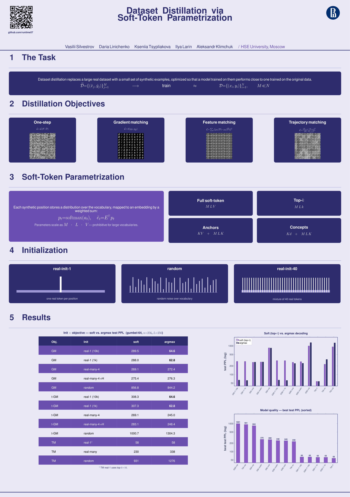

# Dataset Distillation

This repository contains experiments on text dataset distillation for language modeling.

The project includes training pipelines, distillation objectives, soft-token optimization, trajectory matching, and evaluation scripts for comparing distilled synthetic datasets with real-data training.

See the [paper](main.pdf) for detailed results and methodology.



## Installation

Create and activate a new environment:

```bash
conda create -n dataset_distillation python=3.13 -y
conda activate dataset_distillation
```

Clone the repository:

```bash
git clone git@github.com:runtime57/dataset-distillation.git
cd dataset-distillation
```

Install dependencies:

```bash
pip install -r requirements.txt
```

Install pre-commit hooks:

```bash
pre-commit install
```

## Experimental setup

Main setup:

- Model: `TinyTransformerLM`
- Tokenizer: local BPE tokenizer
- Vocabulary size: `1024`
- Number of synthetic sequences: `n = 256`
- Sequence length: `L = 256`
- Main metric: validation / test perplexity

Configs are stored in:

```text
src/configs/
```

## Data preparation

Export TinyStories text data:

```bash
python3 export_tinystories_text.py
```

Train a local BPE tokenizer:

```bash
python3 train_local_bpe_tokenizer.py
```

Tokenizer artifacts are stored in:

```text
artifacts/tokenizers/
```

## Training

To train a language model:

```bash
python3 train.py -cn=CONFIG_NAME HYDRA_CONFIG_ARGUMENTS
```

Example:

```bash
python3 train.py -cn=tinystories_lm_local_bpe_1024
```

## Distillation

To run dataset distillation:

```bash
python3 distill.py -cn=CONFIG_NAME HYDRA_CONFIG_ARGUMENTS
```

Example gradient-matching run:

```bash
python3 distill.py -cn=distill_soft_tokens_gm_10k_seq256_gumbel32_n256_local_bpe_1024
```

Example trajectory-matching run:

```bash
python3 distill.py -cn=distill_soft_tokens_tm_10k_seq256_gumbel32_n256_local_bpe_1024
```

## Evaluation

To run inference or evaluate a model:

```bash
python3 inference.py -cn=CONFIG_NAME HYDRA_CONFIG_ARGUMENTS
```

Example:

```bash
python3 inference.py -cn=tinystories_lm_softdistill_local_bpe_1024
```

## Results

We compare soft-token evaluation with argmax-decoded synthetic sequences. Lower perplexity is better.

| Objective | Initialization | Soft PPL | Argmax PPL | Δ = argmax − soft |
|----------|----------------|---------:|-----------:|------------------:|
| GM | real-1 (10k) | 289.5 | 64.6 | -225 |
| GM | real-1 (1k) | 288.0 | 62.8 | -225 |
| GM | real-many-4 | 269.1 | 272.4 | +3 |
| GM | real-many-4 + H | 275.4 | 276.3 | +1 |
| GM | random | 856.8 | 844.2 | -13 |
| t-GM | real-1 (10k) | 308.3 | 64.6 | -244 |
| t-GM | real-1 (1k) | 307.3 | 62.8 | -245 |
| t-GM | real-many-4 | 269.1 | 245.0 | -24 |
| t-GM | real-many-4 + H | 283.1 | 248.4 | -35 |
| t-GM | random | 1000.7 | 1304.3 | +304 |
| TM | real-1 | 58 | 58 | 0 |
| TM | real-many | 230 | 338 | +108 |
| TM | random | 931 | 1276 | +345 |

Abbreviations:

- `GM` — gradient matching
- `t-GM` — token-wise gradient matching
- `TM` — trajectory matching
- `PPL` — perplexity

## Authors

Vasilii Silvestrov, Daria Linichenko, Kseniia Tsypliakova, Ilya Larin, Aleksandr Klimchuk.

HSE University, Moscow.

## License

This project is released under the MIT License.